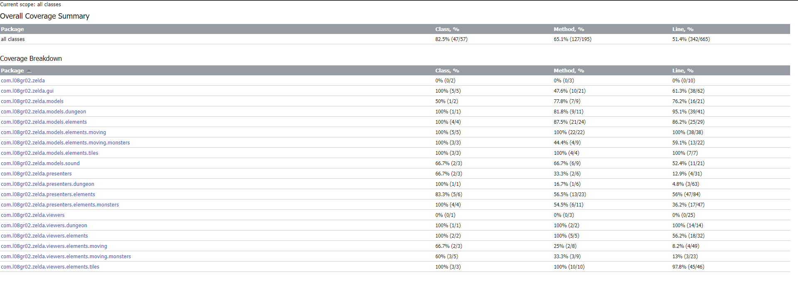

# project-l08gr02 - ZELDA
project-l08gr02 created by GitHub Classroom

> Join Link as he explores the unoptimized terminal of Lanterna

After saving Hyrule once again, Link decides to take a well-earned nap. However, he is cursed in his sleep by a furious programmer that could not beat his last game. When he wakes up from his slumber, our hero finds himself in a treacherous Lanterna terminal. Embark on a brand new adventure and help Link escape the evil Exceptions and Null Pointers!

This project was developed by Andreia Silva (up202108769@up.pt), Gonçalo Nadais de Pinho (up202108672@up.pt) and Tomás Sucena Lopes (up202108701@up.pt) for LDTS 2022⁄23.

-----
### UML Class Diagram

The following UML diagram represents how the various game classes interact with each other:


-----
### IMPLEMENTED FEATURES

- **Movement** - Link can move in four directions: up (:arrow_up_small: or W), down (:arrow_down_small: or S), left (:arrow_backward: or A) and right (:arrow_forward: or D).
- **Attack:crossed_swords: -** When you press the SPACE bar, Link fiercely swings his sword. Use this to defend yourself against the Exceptions.
- **Collision -** A collision will occur when Link is in the same position as an enemy, causing our hero to take damage.
- **Lose life -** Link starts out with 3 lives, represented as hearts on the screen. Everytime an enemy collides with him, Link takes damage and loses some hearts, depending on the strength of the attack.

-----
### PLANNED FEATURES

- **Attack:crossed_swords: -** When you press the SPACE bar, Link will fiercely swing his sword. Use this to defend yourself against the Exceptions.
- **Shoot:bow_and_arrow: -** Press the left mouse button to make Link shoot his trusty bow. His arrows may be limited, but they sure are lethal!
- **Collect Object:mag: -** When Link is in the same position as an object he collects it. Use to obtain all the objects of the game.
- **Menu -** There will be a menu when the game opens with the start and instructions options.
- **Game Over -** If the player loses the game, there will be a message on the screen.

-----
### DESIGN

> For further insight into our implementation of the design patterns, please consult the UML Class diagram above

#### THE SOLID PRINCIPLES MUST BE RESPECTED

**Problem in Context**

In 2000, Robert C. Martin published five design principles that would revolutionise object-oriented programming as we know it: the SOLID principles. Among many other benefits, applying these principles increases code reusability and assures the structure of a project does not collapse every time a new feature is added. Because of this, we had to brainstorm a way to structure our code without defying SOLID.

**The Pattern**

We applied the MVP (Model-View-Presenter) architectural pattern, wherein the Presenter establishes the connection between the data (Model) and the *User Interface* (Viewers). It is a variation of the more widely known MVC (Model-View-Controller) pattern.

To find out more about MVP, click [here](https://www.geeksforgeeks.org/mvp-model-view-presenter-architecture-pattern-in-android-with-example/).


**Implementation**

Classes are divided in three subtypes:

- **Models -** Contain the data of the game and methods that can alter it
- **Presenter -** Function as the "*middle man*" between the Models and the Viewers. They are responsible for appropriately calling all methods defined in the Models (to update the game data) and the Viewers (to update the GUI), as well as handing data to the Viewers
- **Viewers:** Display the game on the screen, according to the current data (which is provided to them by the Presenters)

**Consequences**

The following benefits were made possible by using the MVP pattern:

- It is significantly easier to add new features, considering that we only need to focus on which category it falls into (Model, Viewer or Presenter)
- Refactoring our code is more accessible


##

#### ALL ELEMENTS SHOULD BEHAVE SIMILARLY

**Problem in Context**

When considering how we wanted to program the distinct elements that compose our game, we realized that treating every single element individually would clutter our code and convolute the implementation of a game loop. In fact, some elements, such as the different kinds of enemies Link will face, behave almost identically, to the point where it would be foolish to separate them.

**The Pattern**

To solve this issue, we implemented Strategy. This design pattern establishes a set of actions, encapsulates each one and makes them interchangeable. 

**Implementation**

Entities that perform similar actions inherit/implement the same superclass/interface, respectively. For instance:

- **Mover -** All moving elements extend the ```Mover``` abstract class, which in turn implements the ```Moving``` interface.
- **Creatures -** Entities that can take damage extend the Creature abstract class, which extends Mover and implements ```Health```.
- **Fighter -** Creatures that attack, such as Link, extend the Fighter class, which implements the ```Fighting``` interface.

The interfaces that serve as the basis of our Strategy pattern can be found in the following files:

- [Moving](https://github.com/FEUP-LDTS-2022/project-l08gr02/blob/master/src/main/java/com/l08gr02/zelda/models/elements/Element.java) (abstract class)
- [MovingElement](https://github.com/FEUP-LDTS-2022/project-l08gr02/blob/master/src/main/java/com/l08gr02/zelda/models/elements/MovingElement.java) (abstract class)
- [Presenter](https://github.com/FEUP-LDTS-2022/project-l08gr02/blob/master/src/main/java/com/l08gr02/zelda/presenters/Presenter.java) (abstract class)
- [Viewer](https://github.com/FEUP-LDTS-2022/project-l08gr02/blob/master/src/main/java/com/l08gr02/zelda/viewers/Viewer.java) (interface)

**Consequences**

- Our code is easier to interpret, as the purpose of most classes can be pinpointed if we examine the classes it extends or the interfaces it implements.
- Unit testing is more efficient, as we can test several classes at a time (provided they share the same properties)

**The Pattern**

We implemented the strategy pattern, implementing interfaces on multiple classes that difference only in their behavior.

**Implementation**

The following interfaces have methods that will be needed for multiple game caracters, but they will have different variants of the algorithm.     

- Collision - Is implemented by Bush, CollidingElement, Creature, Fighter, Heart, Link, Log, Monster, Mover and Weirdo classes;
- Fighting - Implemented by the Fighter and Link classes;
- Health - The Creature abstract class implements the Health interface;
- Movement - Implemented by the Mover abstract class.


------

### KNOWN CODE SMELLS

**Object-Orientation Abusers:**
- Switch Statements 
  - This occurs more than once in our code: 
  - Processing link instructions in the Link class or in the draw method on class BushViewer. 
  - This code smell violates the Open-Closed Principle and one solution for it would be implementing new classes.    

**Dispensables:**
- Comments
  - We use comments in some complex methods for a readers better understanding;
- Lazy Classes
  - For extend some classes, following the Open-Closed Principle, we created classes like Grass and Heart that do not do much, creating this smell.
- Duplicate Code
  - This occurs when we have two code fragments look almost identical, like the setSprite method in the WeirdoViewer and LogViewer.  To fix this, we could create a more abstract method, that could be used to do the same job as the other two methods.
------

### TESTING

#### Mutation testing
Since Pitest was being uncooperative, we could not access our mutation coverage report.

#### Coverage report


[Coverage report](https://github.com/FEUP-LDTS-2022/project-l08gr02/tree/master/docs/report)

#### PBT

Using JQwik, we created numerous property-based tests.

------

### SELF-EVALUATION

- **Andreia Silva:** 33.3%
- **Gonçalo Nadais de Pinho:** 33.3%
- **Tomás Sucena Lopes:** 33.3%

